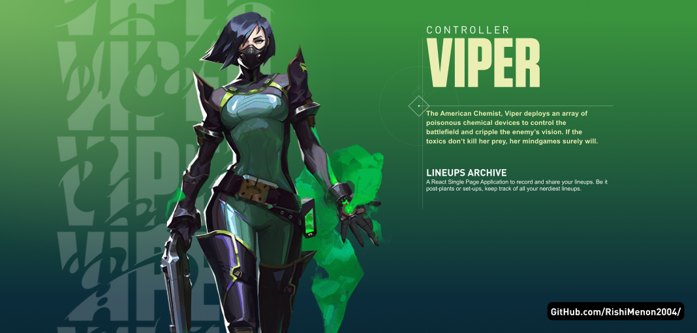

# Viper Lineups

## Introduction
I kinda made this to use for myself, and I never planned to let anyone use it or tweak it, but I figured I'd make it open so anyone interested can clone it and tweak it for their own Valorant agent.

## Tech Stack
This is a `create-react-app` project. You will need intermediate knowledge of React.

It is a `typescript` project, so please be familiarised with it's little kinks and typing before diving into this.

I use [convex.dev](https://www.convex.dev/) for my backend, so make sure to check out the [docs](https://doc.convex.dev/) before messing with the backend.

It should handle all the basic functions as is and you'd only need to set up the database with some default values for the `tags` table.

## Code
Again, because I didn't plan to let anyone tinker with this project, as of now my code is super messy.

Over time I will be cleaning it up and making things more readable,  useable and extensible.

## Development
Given that you have read the Convex docs, I would assume that you have done `$ npx convex init` and have initialised your convex project. 

> This requires you to login with your GitHub account and authorise Convex.

After you've done that, you'll need to start two terminal sessions and run one of these commands in each

1. `$npm start`

2. `$npx convex dev`

And you're all set to go :+1:

**READ CONVEX DOCS ON [HOSTING](https://docs.convex.dev/using/hosting) BEFORE DEPLOYING TO NETLIFY OR VERCEL**
